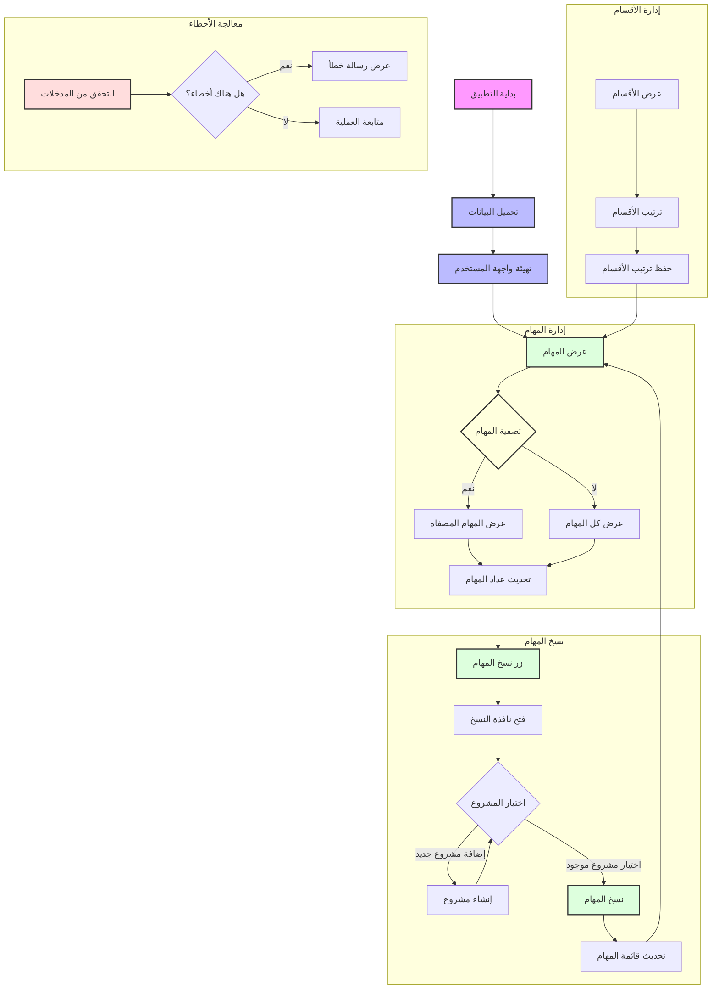

# مخطط تدفق البرنامج

## شرح المخطط

### المكونات الرئيسية
1. **بداية التطبيق**: نقطة بداية تشغيل التطبيق
2. **تحميل البيانات**: تحميل المهام والأقسام والمشاريع
3. **تهيئة واجهة المستخدم**: إعداد العناصر التفاعلية والأحداث

### وظائف إدارة المهام
- **عرض المهام**: `renderTaskTable()`
- **تصفية المهام**: `filterTasks()`
- **تحديث عداد المهام**: `updateTaskCounter()`

### وظائف نسخ المهام
- **فتح نافذة النسخ**: `openBulkCopyModal()`
- **إنشاء مشروع**: `quickAddProject()`
- **نسخ المهام**: `bulkCopyTasks()`

### وظائف إدارة الأقسام
- **ترتيب الأقسام**: `initSortable()`
- **حفظ الترتيب**: `saveSectionOrder()`

### معالجة الأخطاء
- **التحقق من المدخلات**: مختلف وظائف التحقق
- **عرض رسائل الخطأ**: `showError()`

## العلاقات بين الوظائف

1. **تسلسل العرض**:
   - تحميل البيانات → تهيئة الواجهة → عرض المهام
   - عرض المهام → تحديث العداد → إتاحة النسخ

2. **تسلسل النسخ**:
   - فتح النافذة → اختيار المشروع → نسخ المهام → تحديث العرض

3. **تسلسل إدارة الأقسام**:
   - عرض الأقسام → ترتيب → حفظ → تحديث العرض

4. **معالجة الأخطاء**:
   - التحقق → عرض الخطأ أو متابعة العملية 